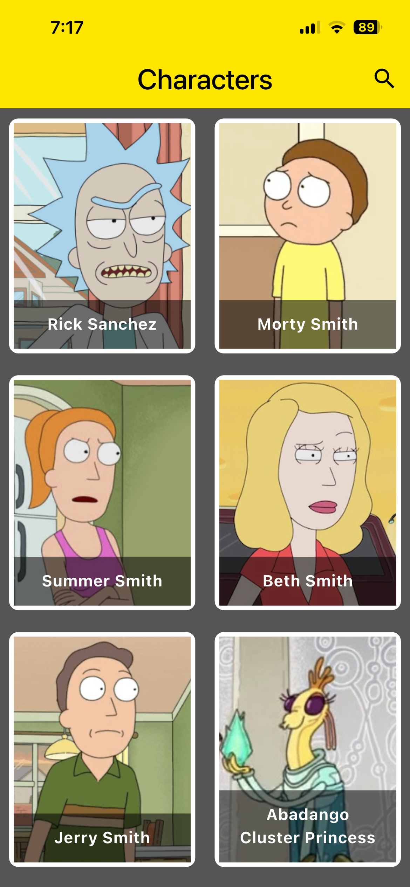
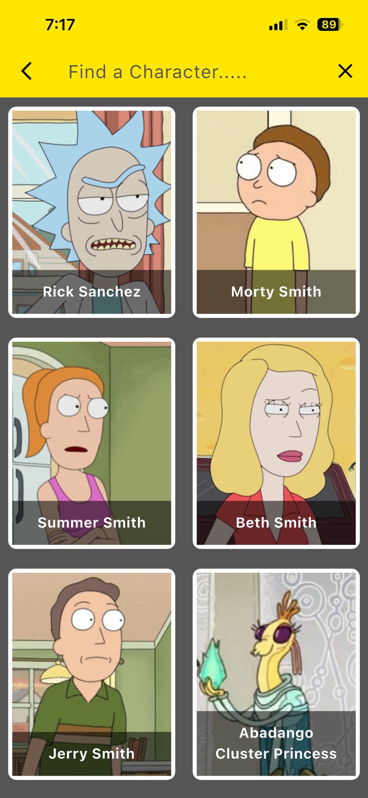
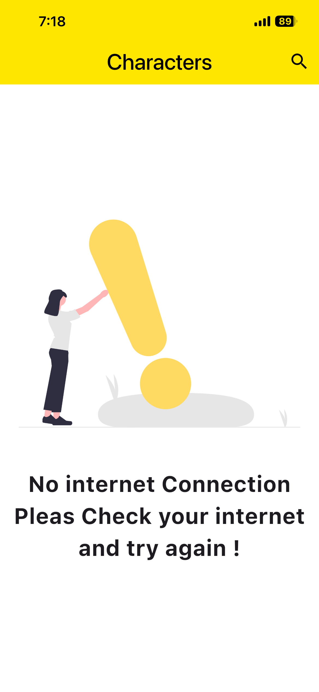
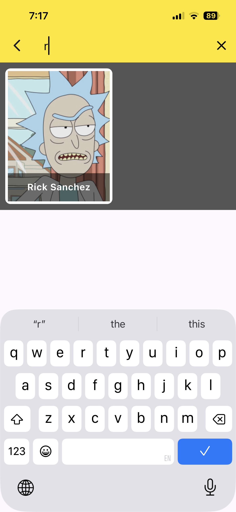
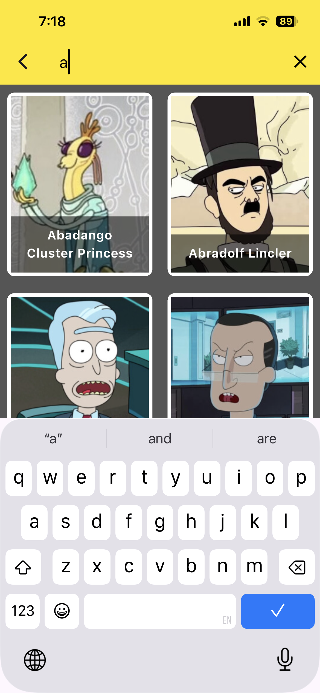
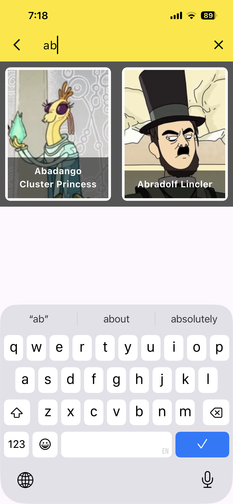
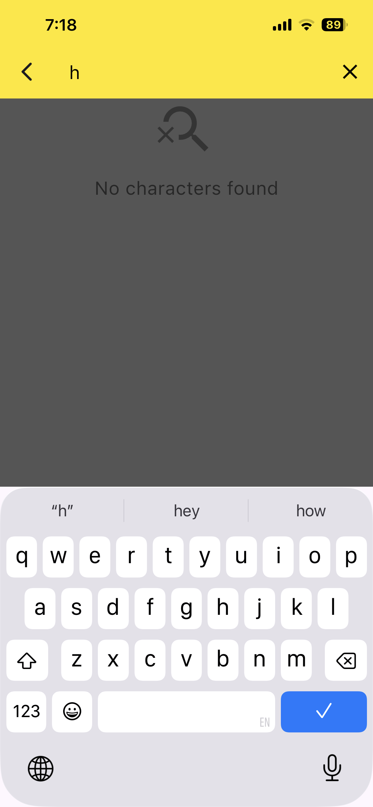

# Rick and Morty Explorer 🛸

A Flutter app for browsing characters from the Rick and Morty universe, built with a clean, layered architecture, the BLoC/Cubit pattern, and a fully responsive UI.

## ✨ Features

- 🧪 Browse all Rick and Morty characters in a responsive grid view (scales across devices via `flutter_screenutil`)
- 🔍 **Live search** — filter characters by name as you type, with a dedicated "no results found" state
- 🌐 **Real-time connectivity detection** — the app listens for network changes and shows a friendly "No internet connection" screen when offline
- 🎬 **Character details screen** with a `Hero` image transition from the grid into a `SliverAppBar`, plus status/species/gender info
- 🖼️ Smooth network image loading with custom animated loading indicators and graceful error handling (broken/missing images won't crash the UI)
- 💫 Custom loading animations throughout the app via `loading_animation_widget` (replacing the default spinner)
- 🏗️ Clean separation of concerns: **API layer → Repository → Cubit → UI**
- 🔄 Type-safe state management using `flutter_bloc` Cubit with Dart 3 sealed classes
- 🧭 Centralized named-route navigation via `AppRouter`, including passing arguments (selected `Character`) to the details screen

## 🚧 Roadmap

- ✨ Animated text effects for character names/details
- 📴 True offline support — persisting fetched characters locally (e.g. Hive/sqflite) so the app stays usable (not just informative) when there's no connection
- 🧪 Unit/widget tests for the Cubit and repository layers

## 📱 Screenshots

| Home Screen | Search Activated | No Internet |
|---|---|---|
|  |  |  |

### 🔍 Search in Action

<p align="center">
  
  
  
  
</p>

## 🛠️ Tech Stack

- **Flutter** & **Dart**
- **flutter_bloc** (Cubit) for state management
- **Dio** for HTTP networking
- **flutter_screenutil** for responsive sizing across screen sizes
- **flutter_offline** for real-time connectivity detection
- **loading_animation_widget** for custom loading indicators
- [Rick and Morty API](https://rickandmortyapi.com/) as the data source

## 🏗️ Architecture

```
lib/
├── business_logic/
│   └── cubit/
│       ├── characters_cubit.dart
│       └── characters_state.dart
├── constants/
│   ├── my_colors.dart
│   └── strings.dart
├── data/
│   ├── api/
│   │   └── characters_api.dart
│   ├── models/
│   │   └── character.dart
│   └── repository/
│       └── characters_repository.dart
├── presentation/
│   ├── screens/
│   │   ├── characters_screen.dart
│   │   └── characters_details_screen.dart
│   └── widgets/
│       └── cahracter_item.dart
├── app_router.dart
└── main.dart
```

**Data flow:**
`CharactersApi` (Dio HTTP calls) → `CharactersRepository` (JSON → `Character` model mapping) → `CharactersCubit` (state management) → UI (`CharactersScreen`, `CahracterItem`, `CharactersDetails`)

## 🚀 Getting Started

### Prerequisites
- [Flutter SDK](https://docs.flutter.dev/get-started/install) installed
- An editor such as VS Code or Android Studio

### Installation
```bash
git clone https://github.com/moalaa125/rickandmorty.git
cd rickandmorty
flutter pub get
flutter run
```

## 🌐 API Reference

This app consumes the free, public [Rick and Morty API](https://rickandmortyapi.com/documentation):

```
GET https://rickandmortyapi.com/api/character
```

No API key required.

## 👤 Author

**Mohamed Alaa**
- GitHub: [@moalaa125](https://github.com/moalaa125)
- LinkedIn: [Mohamed Alaa](https://linkedin.com/in/mohamed-alaa-839738308)
- Portfolio: [moalaa1.netlify.app](https://moalaa1.netlify.app)

## 📄 License

This project was built for educational/portfolio purposes.